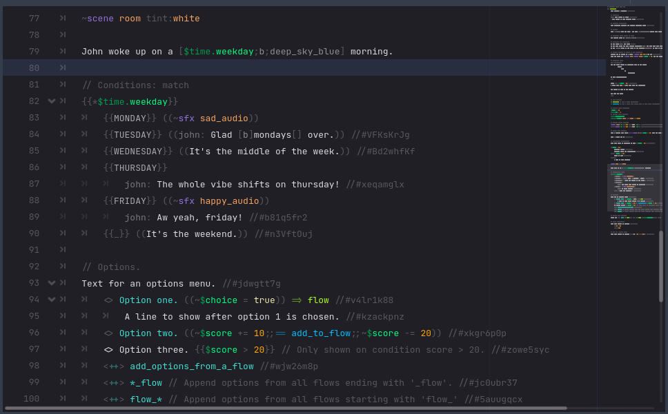
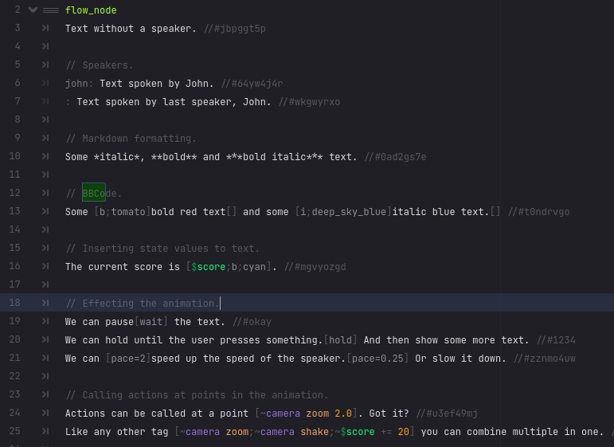
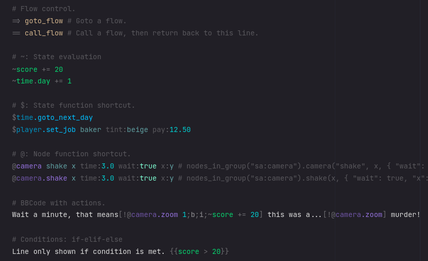
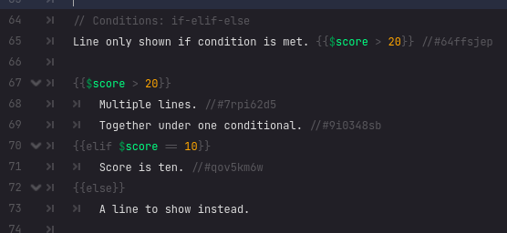

# Sooty `0.1_unstable` `Godot4`
A dialogue engine for Godot4.

`WARNING: Currently under **heavy** construction.`



Example project [here](https://github.com/teebarjunk/sooty-example).


# Features
- Scripting language with highlighter.
- `BBCode Evolved®` with Markdown features.
- Advanced text animation system.
- Built with modding support in mind.
- Built with localization in mind.

# Text and BBCode


Tags:
Any number of tags can be housed together in the same brackets: `[b;tomato]Bold Red Text[]`

Calling `[]` closes the last tag chain. `[/]` closes all open tags chains.

Some tags are self closing.

|tag|desc|options|
|---|----|-------|
|*color_name*|Use any built in Godot color name: `[deep_sky_blue]Blue Text[]` ||
|(n,n,n,n)|RGBA color. For use with format: `"[%s]text[]" % Color.TEAL`||
|*float*|Multiply current font size: `Speak [i;0.8]very quietly[].`||
|*int*|Add to current font size: `Speak [i;4]very loudly[].`||
|`dim`|Dims color by 33%.||
|`lit`|Lightens color by 33%.||
|`hue` `sat` `val`|Modify hue/sat/val of color.||
|`:emoji_name:` `:)`|Tags wrapped in `::` will use the emoji.<br>Some old fashioned emojis are supported. `[:)]`,||
|`\|pipe`|Will pipe text through a function.||
|`$property`|Inserts the value of a state.<br>Will auto close any style it's wrapped with:<br>`The [$stranger;b;red] looks at you.`<br>Can be piped to a function. `[$player.coins\|commas]`||
|`lb` `rb`|Insert brackets *[]*||

Along with typical: `b` `i` `bi` `u`

*Animation specific tags.*

|tag|desc|options|
|---|----|-------|
|`wait`|Pause the animation.|`[w]` `[wait]` `[w=2]`|
|`hold`|Hold animation till user action.|`[h]` `[hold]`|
|`jump`|Jump animation forward. So entire word or phrase can pop in.<br>`I already told you [jump]NO[][w] [jump]MORE[][w] [jump]LEAVING MY THINGS OUT![][w]`
|`pace`|Change pace of animation.|`[p]` `[pace]` `[p=2]`|
|`~action`|Call any [action](#actions) at that point in the animation.||

*Custom text effects*<br>**TODO**

Try combining emojis and animations: `Press the [2.0;sin;:arrow_up:;] key!`<br>
This will double the scale, play the sin wave animation, show the up arrow emoji, and then close.

## Pipes
Values can be piped through functions: `You have [$apples|commas] apples.` -> `You have 1,234,567 apples.`

So can text: `I have [|commas]1234567[] apples.` -> `I have 1,234,567,apples.`


## Shortcuts
In `config.cfg` you can set shortcuts for complex actions and custom colors:

```cfg
[rich_text_shortcuts]
cam1="~camera shake 2.0;~camera zoom 2.0;wait=0.5"
cam_reset="~camera shake 0.0;~camera zoom 1.0
highlight="cherry;b;u"
pscore="$player.score|commas;b;greeny

[rich_text_colors]
cherry="#FF9053"
greeny="#BBEE32"
```

Now use them like any other BBCode.

```
My score\: [pscore] points.
john: These [cherry]cherries[] sure look good. [cam1]Wait, these aren't cherries.[cam_reset] They're blueberries.
```

# Actions


Starting with a `~` actions can do a number of things.

Actions are bracket-less `()` and comma-less `,` except for arrays.
```
// for node in get_tree().get_nodes_in_group("camera"):
//		node.camera("shake", 10, { "rotate": true })
~camera shake 10 rotate:true

// State.player.damage("fire", 10, { "rand": [2, 3 ] })
~$player.damage fire 10 rand:2,3

// for strings with spaces, use ""
// State.player.set_name("The Lone Wanderer")
~$player.set_name "The Lone Wanderer"

// to state variables inside a function, use $
// State.enemy.damage("head", 2, 10)
~$enemy.damage $player.target $damage_modifier 10
```

Modify state variables, and call state functions, with `$`
```
~$score += 20
~$player.damage 10
```

## Operator Overloads
`StringActions` has basic support for operator overloads.

Look at the *VStat* class `VStat.gd`:
```
var value = 0

func _operator_get():
	return value

func _operator_set(x):
	value = x
```
This allows us to do `stat += 1` instead of `stat.value += 1`

# Conditionals



# Modding
**TODO**
All state data (main and mods) is loaded at once. Internally, the main data is treated like a mod.

## Folders
On `_init`, an autoload should call `Mods.install_mod(directory)`.
Inside that directory can be directories for:

|Folder|File type(s)|Desc|
|:-----|-----------:|:---|
|`dialogues/`| `*.soot`|Dialogue files.|
|`states/`| `*.gd`|Node scripts contain state data.|
|`states_persistent/`| `*gd`|Node scripts containing persistent state data.|
|`scenes/`| `.tscn` `.scn`|Scenes accessed by name.|


# Localization
**TODO**
End of line comment of form `//#unique_line_id`<br>
These can be auto generated.

# States
The `State` class and `Persistent` are where game properties should be accessed.

`State` loads scripts in `res://states` as node children.  
- Characters
- World states

`Persistent` loads scripts in `res://states_persistent` as node children.
- Achievements
- Unlockables

From `State` you can access anything in `Persistent`: `State.achievement_NiceJob.progress > 0`

All initial values are tracked, and then any value that changes will be saved.

*WARNING:* Properties across scripts should be unique, as they are accessed on a first name basis.

```
# If you do this, only one of these properties will be saved, and accessible through State.

#characters.gd
var fields := Character.new({name="Mr. Fields"})

#locations.gd
var fields := Location.new({name="The Fields"})
```

# Exporting
Make sure to include `*.soot,*.cfg` files when exporting.
