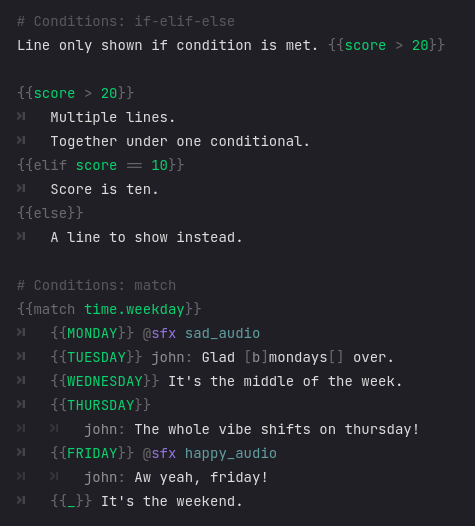

# Sooty `0.1` `Godot4a6`
A dialogue engine for Godot4 (alpha6).

See [docs](https://teebarjunk.github.io/sooty-docs/) for more info.

`WARNING: Currently under **heavy** construction.`  


# Features
- [Scripting language](#soot) with highlighter.
- [`BBCode Evolved®`](#bbcode) with Markdown features.
- Custom [data format](#soda), inspired by YAML.
- Built with [modding](#mods) support in mind.
- Various [translation](#sola) systems and tools.
- A [tree view](#tree_view) to see how dialogue is connected.
- Robust [save system](#save_system) with no setup.

# Projects
- Visual novel template [here](https://github.com/teebarjunk/sooty-visual_novel).  
- Example visual novel [here](https://github.com/teebarjunk/sooty-visual_novel-example).  

# <a name="bbcode"></a> Text and BBCode
See [docs](https://teebarjunk.github.io/sooty-docs/dialogue/bbcode_evolved.html).


# Actions


|Char|Description|Example|
|----|-----------|:-----:|
|`~`|State expression.|`~score += pow(my_power(), 2)`<br>Is equivalent to:<br>`State.score += pow(State.my_power(), 2)`|
|`$`|State function shortcut.|`$player.damage 10 type:water`<br>Is equivalent to:<br>`State.player.damage(10, {"type":"water"})`|
|`@`|Group function shortcut.|`@camera.shake false y:0.5`<br>Is equivalent to:<br>`get_nodes_in_group("camera").shake(false, {"y":0.5})`|

Function shortcuts are bracket-less `()` and comma-less `,` except for arrays:  
`$reset player,john,mary 100 health,exp`  
Is equivalent to:  
`State.reset(["player", "john", "mary"], 100, ["health", "exp"])`

# Conditionals
See [docs](https://teebarjunk.github.io/sooty-docs/dialogue/conditions.html).



Basic `match` statements work, with support for arrays and dicts comming.

# <a name="mods"></a> Modding
See [docs](https://teebarjunk.github.io/sooty-docs/state/mods.html).

Everything is treated as a mod. `res://` is loaded as if it were a mod.  
The system was designed with modding/expansions/patches/translations in mind.  

Inside a `mod` directory can be directories for:

|Folder|File type(s)|Desc|
|:-----|-----------:|:---|
|`dialogue/`| `.soot`|Dialogue files.|
|`lang/`|`.sola`|Translation files.|
|`states/`| `.gd` `.soda`|Node scripts or data files.|
|`persistent/`| `.gd` `.soda`|Node scripts or data files.|
|`scenes/`| `.tscn` `.scn`|Main scenes, with unique names.|
|`audio/music/`| `.wav` `.mp3` `.ogg`|Music.|
|`audio/sfx/`| `.wav` `.mp3` `.ogg`|Sound effects.|

User mods can have their own folder in `user://mods`.  
Notice the [Visual Novel](https://github.com/teebarjunk/sooty-visual_novel-example) system treats itself as a "mod".

# <a name="soot"></a> Dialogue Language `.soot`
See [docs](https://teebarjunk.github.io/sooty-docs/dialogue.html).

Script names are used internally as the `Dialogue` id. They contain *Flows*, which start with `===`.
- `=>` Goto flow.
- `==` Run flow, then continue from here.
- `><` Ends the current flow.
- `>><<` End all flows.
- `__` Pass. Does nothing. But has it's uses.

```
#my_story.soot
=== START
	Once upon a time.
	=> chapter_1

=== chapter_1
	There lived a dog.
	=> other_chapters.chapter_2


#other_chapters.soot
=== chapter_2
	The dog was a fast runner.
```

# <a name="sola"></a> Language Files `.sola`  
See [docs](https://teebarjunk.github.io/sooty-docs/translations/lang_files.html).

You can generate `.sola` files for translating text.  
It's becoming a robust system.  
It can handle replacing multiple lines with 1 or 1 line with mutiple.  
And if lines are removed, they won't be lost or erased from the .sola file.

|`test.soot`|`test-fr.sola`|
|--|--|
| | |

# <a name="soda"></a> Data Files `.soda`
See [docs](https://teebarjunk.github.io/sooty-docs/state/data_files.html).

Sooty has a custom file format based on YAML, but designed for Godot.  
It has a built in highlighter, and works in Godot's main editor.  

|||
|-|-|
|||


# <a name="tree_view"></a> TreeView (wip)
An alternative FileSystem, that let's you go to specific lines and view how `.soot` files are connected.  

Currently files have to be manually opened in editor once before they can be opened with TreeView.


# Building/Exporting
Make sure to include `*.soot,*.soda,*.sola` files when building.
