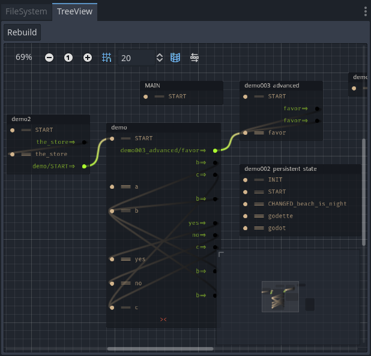

# Sooty `0.1` `Godot4a6`
A dialogue engine for Godot4 (alpha6).

`WARNING: Currently under **heavy** construction.`  


# Features
- [Scripting language](#soot) with highlighter.
- [`BBCode Evolved®`](#bbcode) with Markdown features.
- Custom [data format](#soda), inspired by YAML.
- Built with [modding](#mods) support in mind.
- Various [translation](#sola) systems and tools.
- A [tree view](#tree_view) to see how dialogue is connected.
- Robust [save system](#save_system) with no setup.

# Examples
- *Visual Novel* template [here](https://github.com/teebarjunk/sooty-visual_novel).  
- Example visual novel [here](https://github.com/teebarjunk/sooty-visual_novel-example).  

# Docs
- [Getting Started](readme/getting_started.md)
- [Writing Soot](readme/writing_soot.md)

# <a name="bbcode"></a> Text and BBCode
Checkout the BBCode section of [Writing Soot](readme/writing_soot.md#bbcode).


# Actions


|Char|Description|Example|
|----|-----------|:-----:|
|`~`|State expression.|`~score += pow(my_power(), 2)`<br>Is equivalent to:<br>`State.score += pow(State.my_power(), 2)`|
|`$`|State function shortcut.|`$player.damage 10 type:water`<br>Is equivalent to:<br>`State.player.damage(10, {"type":"water"})`|
|`@`|Group function shortcut.|`@camera.shake false y:0.5`<br>Is equivalent to:<br>`get_nodes_in_group("camera").shake(false, {"y":0.5})`|

Function shortcuts are bracket-less `()` and comma-less `,` except for arrays:  
`$reset player,john,mary 100 health,exp`  
Is equivalent to:  
`State.reset(["player", "john", "mary"], 100, ["health", "exp"])`

# Conditionals


Basic `match` statements work, with support for arrays and dicts comming.

# <a name="mods"></a> Modding
Everything is treated as a mod. `res://` is loaded as if it were a mod.  
The system was designed with modding/expansions/patches/translations in mind.  

Inside a `mod` directory can be directories for:

|Folder|File type(s)|Desc|
|:-----|-----------:|:---|
|`dialogue/`| `.soot`|Dialogue files.|
|`lang/`|`.sola`|Translation files.|
|`states/`| `.gd` `.soda`|Node scripts or data files.|
|`persistent/`| `.gd` `.soda`|Node scripts or data files.|
|`scenes/`| `.tscn` `.scn`|Main scenes, with unique names.|
|`audio/music/`| `.wav` `.mp3`, `.ogg`|Music.|
|`audio/sfx/`| `.wav` `.mp3`, `.ogg`|Sound effects.|

User mods can have their own folder in `user://mods`.  
Notice the [Visual Novel](https://github.com/teebarjunk/sooty-visual_novel-example) system treats itself as a "mod".

# <a name="soot"></a> Dialogue Language `.soot`

Script names are used internally as the `Dialogue` id. They contain *Flows*, which start with `===`.
- `=>` Goto flow.
- `==` Run flow, then continue from here.
- `><` Ends the current flow.
- `>><<` End all flows.
- `__` Pass. Does nothing. But has it's uses.

```
#my_story.soot
=== START
	Once upon a time.
	=> chapter_1

=== chapter_1
	There lived a dog.
	=> other_chapters.chapter_2


#other_chapters.soot
=== chapter_2
	The dog was a fast runner.
```

# <a name="sola"></a> Language Files `.sola`  
You can generate `.sola` files for translating text.  
It's becoming a robust system.  
It can handle replacing multiple lines with 1 or 1 line with mutiple.  
And if lines are removed, they won't be lost or erased from the .sola file.

|`res://test.soot`|`res://test-fr.sola`|
|--|--|
| | |

# <a name="soda"></a> Data Files `.soda`
Sooty has a custom file format based on YAML, but designed for Godot.  
It has a built in highlighter, and works in Godot's main editor.  
Store the files in `states/` or `persistent/` to have them auto install.  

They can be accessed:
- In Godot, with `State`: `State.characters.paul.name`.
- In `.soot` script with `$`: `$characters.paul.name`

|||
|-|-|
|||

## Features
### Auto type conversion
Data is auto converted to whatever type is at the path destination.  
If the property has no explicit type, it will be assumed.
```
#your_script.gd
class_name Guy
var name := ""
var coin := 0
var tint := Color.WHITE


#your_data.soda
guy1=Guy:
	name: Mr. Man		# converts to String: "Mr. Man"
	coin: 80		# converts to int: 80
	tint: #ff0000		# converts to Color("#ff0000")
guy2=Guy:
	name: 1			# converts to String: "1"
	coin: 9_000_000  	# converts to int: 9000000
	tint: TOMATO		# converts to Color.TOMATO
```

### Shortcuts
To make nested properties shorter, there are shortcuts.  
They begin with `~~` followed by an address.
```
#data.soda
~~p: characters.player
~~coins: characters.player.inventory.coins

characters:
	player:
		name: Mary
		inventory:
			coins: 13

#dialogue.soot
p: My name is [~p.name] and I have [~coins] coins.
~coins += 20
p: Now I have [~coins].
```

### Flagged alternatives
To ease with testing, if a flag is inside `Global.flags` an alternative key can be used:
```
my_data:
	name: Coolman
	coin: 0

	# If "dbg" in Global.flags, these properties will be used.
	name?dbg: Coolman Debug
	coin?dbg: 1_000

	# If "dbg" and "cheat" in Global.flags, coin will be 1,000,000.
	coin?dbg?cheat: 1_000_000
```

# <a name="tree_view"></a> TreeView (wip)
An alternative FileSystem, that let's you go to specific lines and view how `.soot` files are connected.  

Currently files have to be manually opened in editor once before they can be opened with TreeView.



# <a name="save_system"></a> Save System

Any kind of property can be saved, including built in Godot types like Vector2 and Color, and even complex Objects and Resources.  
For each Object/Resource, a dictionary of properties (only those that have changed) will be saved.  

If you add a property `var save_caption := "Save Name"` it will be shown on the save screen. This could be used to indicate to the player what location, mission, or progress, the slot's data contains. It could contain BBCode.

## Initializing the state
Create a script in `res://states` that extends any `Node`.  
On startup, Sooty will add all scripts in this folder as children of the `State` node.  
All of their properties and functions are now accessible to the scripting system.

```
#state.gd
extends Node

var score := 0

func my_score():
	return "[b]%s[]" % score

func boost_score(amount := 1):
	score += amount


#story.soot
My score is [$my_score].
$boost_score 1234567
My score plus 1,234,567 is [$score].
```

Sooty will automatically save any values that changed, and only values that changed.

*WARNING:* Properties across scripts should be unique, as only the first property with a name will ever be returned.

```
# Only one of these properties will be saved.

#characters.gd
var fields := Character.new({name="Mr. Fields"})


#locations.gd
var fields := Location.new({name="The Fields"})
```

The `State` class has signals you may find useful:  

|Signal|Desc|
|------|----|
|`changed(property: Array[String])`|Property that was changed.|
|`changed_to(property: Array[String], to: Variant)`|Property that was changed and what it was changed to.|
|`changed_from_to(property: Array[String], from: Variant, to: Variant)`|Property that was changed, it's old value, and it's new value.|

`property` is often a path: `my.nested.property`.

# Building/Exporting
Make sure to include `*.soot,*.soda,*.sola` files when building.
