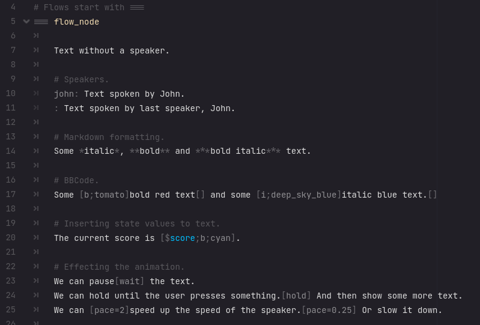

# Sooty `0.1_unstable` `Godot4`
A dialogue engine for Godot4.

`WARNING: Currently under **heavy** construction.`

# Features
- Scripting language.
- Redesigned BBCode like system with Markdown features.
- Text animation system.
- Built with modding support in mind.
- Built with localization in mind.

# Screenshots

## Text and BBCode

## Actions

## Conditionals

# Modding
todo: At bootup, show list of discovered mods, with toggles. Save state to config.
	After clicking accept, selected mods are loaded.
	Need to reboot to uninstall mods.

# Localization
todo

# State and Persistent Data
Initialize state variables in "res://state.gd".
- Characters
- World states

Initialize persistent variables in "res://persistent.gd"
- Achievements
- Unlockables

# Exporting
Make sure to include "*.soot,*.cfg" files when exporting.
