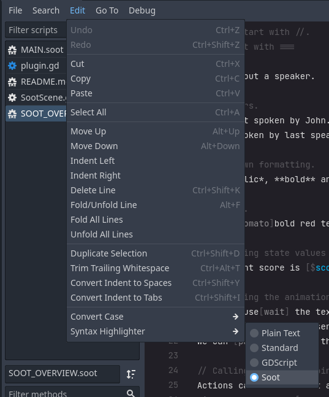

# Writing Soot

To get syntax highligting in Godot, open the file in editor and select `Edit > Syntax Highlighter > Soot`



|Pattern|About|Example|
|-----|-----|-------|
|`// comment`|These are just for you, and are ignored by the system.|`// TODO: Rewrite these lines.`|
|`=== flow id`|The start of a flow; a series of steps to run through.|`=== chapter_1`|
|`text`|Text to show the user.|`Once upon a time...`|
|`name: text`|Text with a speaker.|`robot: Are you sure about this?`|
|`- option text`|An option for a menu.|`- Yes, take me there.`|
|`=> flow_id`|Goto a flow.|`=> chapter_2`|
|`=> soot_id.flow_id`|Goto a flow in a different file.|`=> day_2.morning`|
|`== flow_id`|Call a flow, then return back to this line.|`== describe_scene`|
|`== soot_id.flow_id`|Call a flow in a different file, then return back to this line.|`== funcs.reset_stats`|
|`@action`|Call's a node group function.|`@damage player 20 fire:true`|
|`$action`|Call's a state function.|`$player.damage 20 fire:true`|
|`~state evaluation`|Evaluates an expression on state data.|`~score += 20 * score_multiplier(player.stats)`
|`{{condition}}`|For only displaying lines that pass.|`mary: Oh wow, you brought it. {{talked_to_mary and player.item_count("spoon") > 1}}`|

# Flow Control
*TODO*

# Dialogue

```
Text without a speaker. 

// Speakers.
john: Text spoken by John.
: Text spoken by last speaker, John.

// Markdown formatting.
Some *italic*, **bold** and ***bold italic*** text.

// BBCode.
Some [b;tomato]bold red text[] and some [i;deep_sky_blue]italic blue text.[]

// Inserting state values to text.
The current score is [$score;b;cyan].

// Effecting the animation.
We can pause[wait] the text.
We can hold until the user presses something.[hold] And then show some more text.
We can [pace=2]speed up the speed of the speaker.[pace=0.25] Or slow it down.

// Calling actions at points in the animation.
Actions can be called at a point [!@camera zoom 2.0]. Got it?
Like any other tag [!@camera zoom;!@camera shake;!~score += 20] you can combine multiple in one.

// Multiline text.
""""
You can place *lots* of formatted text in one block.
        *Tabs*
            will
                be
                    preserved.

As will **whitespace**.
""""

// Multiline with a speaker and condition.
paul: """" {{score > 20}}
I don't care what [b]they[] say, it's not happening.

    (He turned to look at the shore.)

Not now, not ever.
""""
```

# Speakers
Text with a `:` before it will have a speaker tag: `mary: What year is it?`

Multiple speakers can be included with a space: `john mary jane paul: We all agree!`

Speaker names will be auto styled with state data:
```
# my_state.gd

var john := Character.new({name="John", color=Color.DEEP_SKY_BLUE})
```

But you can wrap a name in `"` to have it as is: `"[b;gray]Mysterious Stranger[]": Howdy.`

If you want a `:` in a users name, escape it with a `\:`.

# Options

To add options to dialogue, tab lines below, starting with a `-`.

```
Are you sure about that?
    - Yes.
    - No.
    - Maybe.
```

Options can have `{{conditionals}}`

```
guard: Sorry, can't let you in without the password.
    - Doop a doop. {{has_password}}
        guard: Hmm.
        @sfx door_clanking_open
        => enter_the_club
    - Uhm... err... quack-quack?
        guard: Get the hell out of here.
        => back_to_street
    - Oh, well, I don't know it.
        => back_to_street
```

You can write dialogue underneath these lines, so long as it's tabbed.

```
journey_man: Where to, traveler?
    - East.
        We go eastward.
        @sfx wind_002
        => east
    - West.
        We go westward.
        @sfx dust_storm
        => west
    - North.
        journey_man: The cost north is extra. Will you pay?
            - Yes, here you go. {{money >= 5}}
                $money -= 5
            - I don't have money, but I need to get there. {{money < 5}}
                journey_man: Meh, all right, let's go.
                => north
            - Hmm, nevermind.
                journey_man: Suit yourself.
        
```

# Conditionals

|Condition|Description|Example|
|`{{if}}`|The classic *if* statement. You don't need to type *if* though.|`{{if apples > oranges}}` `{{apples > oranges}}`|
|`{{elif}}`|If the previous condition failed, this one will be checked.|`{{elif apples > pears}}`|
|`{{else}}`|If all other conditions failed, this will occur.`{{else}}`|
|`{{match}}`|A condensed pattern.||


## Match

Check out the Godot [tutorial](https://docs.godotengine.org/en/latest/tutorials/scripting/gdscript/gdscript_basics.html#match).

Sometimes they can be a lot nicer/neater that if-else statements.

```
{{*time.weekday}}
    {{MONDAY}} @sfx sad_audio
    {{TUESDAY}} john: Glad [b]mondays[] over.
    {{WEDNESDAY}} It's the middle of the week.
    {{THURSDAY}}
        john: The whole vibe shifts on thursday!
    {{FRIDAY}} @sfx happy_audio
        john: Aw yeah, friday!
    {{_}} It's the weekend.
```
